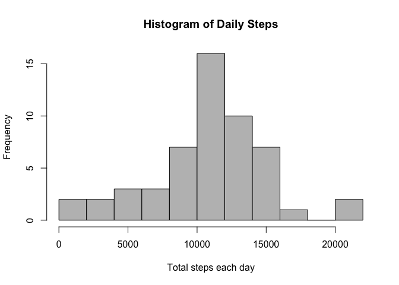

# Reproducible Research: Peer Assessment 1


## Loading and preprocessing the data
Load the libraries we need for the program:


Get data set from the link given in the assignment:

```r
fileurl <- "https://d396qusza40orc.cloudfront.net/repdata%2Fdata%2Factivity.zip"
download.file(fileurl, destfile = "activity.zip", method="curl")
```

Extract (unzip) the downloaded activity set. This will create 'activity.csv' in the working directory.

```r
unzip('activity.zip', overwrite =TRUE)
```

Load the dataset into the program.

```r
data <- read.csv('activity.csv')
```


## What is mean total number of steps taken per day?
Ignore the missing values:

```r
noNAdata <- na.omit(data)
```
Sum the steps of each day:

```r
dframe<-aggregate(noNAdata$steps ~ noNAdata$date, FUN=sum, data=noNAdata)
names(dframe) <- c('date','steps')
```
### Make a histogram of the total number of steps taken each day

```r
hist(dframe$steps,main='Histogram of Daily Steps',xlab='Total steps each day',col='grey')
```

 

### Calculate and report the mean and median total number of steps taken per day
mean of steps taken per day

```r
mean(dframe$steps)
```

```
## [1] 10766.19
```
Median of steps taken per day

```r
median(dframe$steps)
```

```
## [1] 10765
```

## What is the average daily activity pattern?


## Imputing missing values


## Are there differences in activity patterns between weekdays and weekends?
